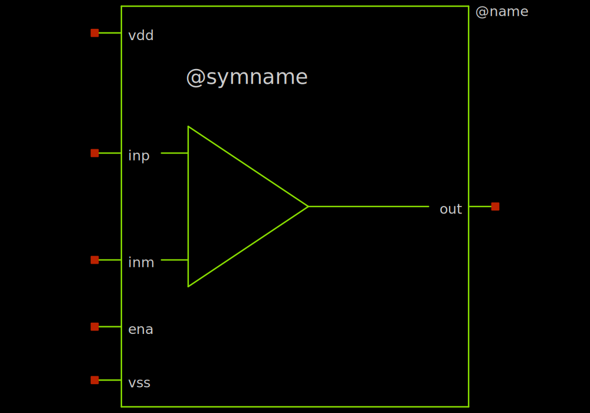
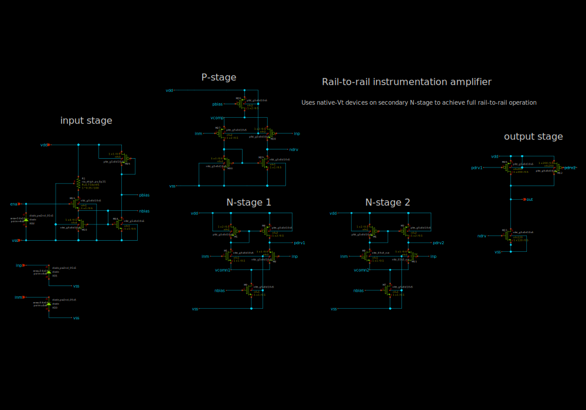
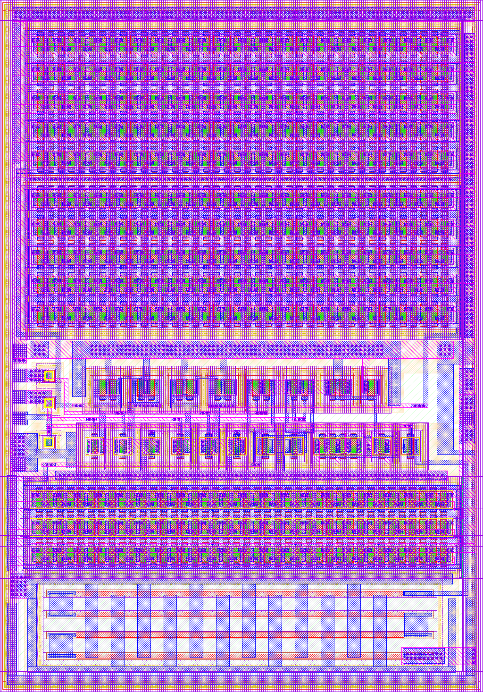
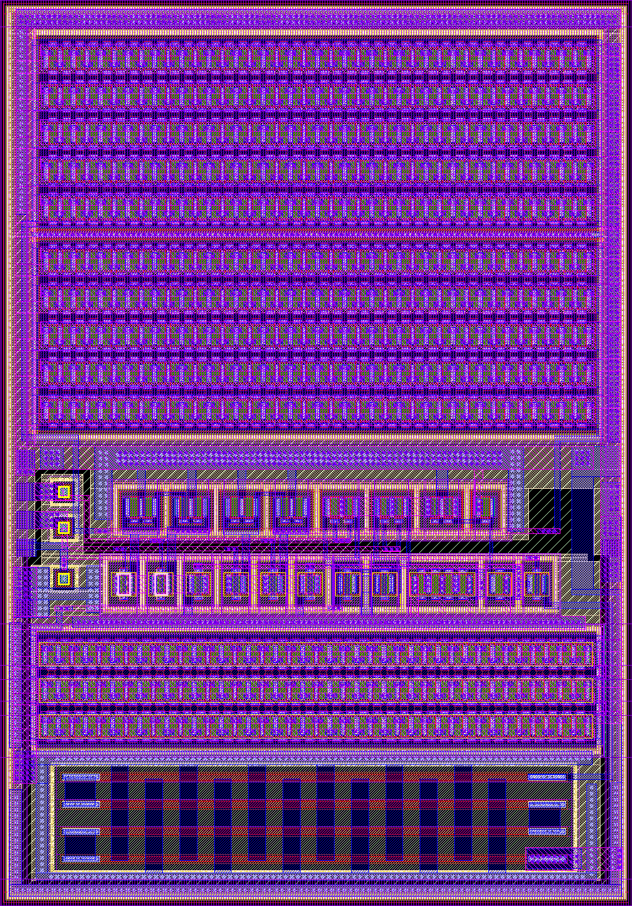

# sky130_ef_ip__opamp

- Description: Rail-to-rail driver operational amplifier
- PDK: sky130A

## Authorship

- Designer: Tim Edwards
- Company: Efabless Corporation
- Created: January 5, 2024
- License: Apache 2.0
- Last modified: None

## Pins

- ena
  + Description: Enable input (active low)
  + Type: digital
  + Direction: input
  + Vmin: vss - 0.3
  + Vmax: vdd + 0.3
  + Note: May be 1.8V or 3.3V signal
- inm
  + Description: amplifier voltage negative input
  + Type: signal
  + Direction: output
  + Vmin: vss - 0.3
  + Vmax: vdd + 0.3
- inp
  + Description: amplifier voltage positive input
  + Type: signal
  + Direction: output
  + Vmin: vss - 0.3
  + Vmax: vdd + 0.3
- out
  + Description: amplifier voltage output
  + Type: signal
  + Direction: output
  + Vmin: vss
  + Vmax: vdd
- vdd
  + Description: Analog power supply
  + Type: power
  + Direction: inout
  + Vmin: 3.0
  + Vmax: 3.6
- vss
  + Description: Analog ground
  + Type: ground
  + Direction: inout
  + Vmin: -0.3
  + Vmax: 0.3

## Default Conditions

- Vvdd
  + Description: Analog power supply voltage
  + Display: vdd
  + Unit: V
  + Typical: 3.3
- Vvss
  + Description: Analog ground
  + Display: vss
  + Unit: V
  + Typical: 0
- Vdvdd
  + Description: Digital power supply voltage
  + Display: dvdd
  + Unit: V
  + Typical: 1.8
  + Note: Reference voltage for the enable input
- Rout
  + Description: Output load resistance
  + Display: RLoad
  + Unit: MΩ
  + Typical: 100
- Cout
  + Description: Output load capacitance
  + Display: CLoad
  + Unit: fF
  + Maximum: 100
- ena
  + Description: Amplifier enable
  + Display: ena
  + Typical: 1
- Vcm
  + Description: Common-mode input voltage
  + Display: Vcm
  + Typical: 1.65
- Vdiff
  + Description: Differential input voltage
  + Display: Vdiff
  + Typical: 0
- temperature
  + Description: Ambient temperature
  + Display: Temp
  + Unit: °C
  + Minimum: -40
  + Typical: 27
  + Maximum: 130
- corner
  + Description: Process corner
  + Display: Corner
  + Minimum: ss
  + Typical: tt
  + Maximum: ff
- iterations
  + Description: Iterations to run
  + Display: Iterations
  + Minimum: 1
  + Maximum: 10
  + Step: linear
  + Stepsize: 1

## Symbol

## Schematic

## Layout

