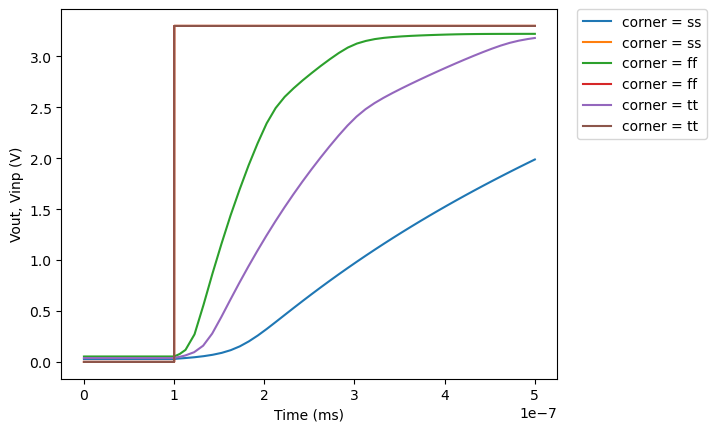

# CACE Summary for sky130_ef_ip__opamp

**netlist source**: rcx

|      Parameter       |         Tool         |     Result      | Min Limit  |  Min Value   | Typ Target |  Typ Value   | Max Limit  |  Max Value   |  Status  |
| :------------------- | :------------------- | :-------------- | ---------: | -----------: | ---------: | -----------: | ---------: | -----------: | :------: |
| Idd                  | ngspice              | result               |             any |  91.607 µA |       170 µA | 122.152 µA |       250 µA | 123.705 µA |   Pass ✅    |
| Idd (dynamic)        | ngspice              | result               |             any |   3.981 µA |        40 µA |   5.219 µA |      6500 µA | 6005.112 µA |   Pass ✅    |
| Standby current      | ngspice              | result               |             any |  50.581 µA |       170 µA |  55.495 µA |       250 µA |  60.018 µA |   Pass ✅    |
| Output voltage low (Vol) | ngspice              | result               |               ​ |          ​ |          any |    0.000 V |        0.1 V |    0.000 V |   Pass ✅    |
| Output voltage high (Voh) | ngspice              | result               |           2.4 V |    3.300 V |          any |    3.300 V |            ​ |          ​ |   Pass ✅    |
| Offset Error         | ngspice              | result               |        -35 %FSR | -33.765 %FSR |       0 %FSR | -2.383 %FSR |     0.5 %FSR | 0.257 %FSR |   Pass ✅    |
| Open-loop Voltage Gain | ngspice              | result               |          100 dB | 117.218 dB |       125 dB | 123.762 dB |       125 dB | 129.703 dB |   Pass ✅    |
| Gain-Bandwidth       | ngspice              | result               |           0 MHz |  0.000 MHz |        4 MHz |  2.368 MHz |        4 MHz |  4.408 MHz |   Pass ✅    |
| Slew Rate Risetime   | ngspice              | result               |        0.5 V/µs | 0.529 V/µs |      10 V/µs | 9.776 V/µs |      20 V/µs | 21.751 V/µs |   Pass ✅    |
| Slew Rate Falltime   | ngspice              | result               |          1 V/µs | 1.116 V/µs |      10 V/µs | 13.571 V/µs |      25 V/µs | 25.040 V/µs |   Pass ✅    |
| Full Power Bandwidth | ngspice              | result               |             any |  0.108 MHz |      2.5 MHz |  1.309 MHz |          any |  2.415 MHz |   Pass ✅    |
| Phase Margin         | ngspice              | result               |           100 ° |  155.067 ° |        160 ° |  157.299 ° |          any |  180.000 ° |   Pass ✅    |
| Gain Margin          | ngspice              | result               |             any | -110.470 dB |      -100 dB | -110.235 dB |          any | -110.145 dB |   Pass ✅    |
| Equivalent Input Noise Voltage @ 1kHz | ngspice              | result               |             any |          ​ |   280 nV/√Hz |          ​ |          any |          ​ |   Pass ✅    |
| Equivalent Input Noise Voltage @ 10kHz | ngspice              | result               |             any |          ​ |   100 nV/√Hz |          ​ |          any |          ​ |   Pass ✅    |
| CMRR @ 100kHz        | ngspice              | result               |             any | -64.420 dB |          any | -51.635 dB |       -40 dB | -43.371 dB |   Pass ✅    |
| PSRR @ 100kHz        | ngspice              | result               |             any | -132.436 dB |          any | -71.114 dB |       -14 dB | -17.037 dB |   Pass ✅    |
| Area                 | magic_area           | area                 |               ​ |          ​ |            ​ |          ​ |          any | 1940.782 µm² |   Pass ✅    |
| Width                | magic_area           | width                |               ​ |          ​ |            ​ |          ​ |          any |  36.820 µm |   Pass ✅    |
| Height               | magic_area           | height               |               ​ |          ​ |            ​ |          ​ |          any |  52.710 µm |   Pass ✅    |
| Magic DRC            | magic_drc            | drc_errors           |               ​ |          ​ |            ​ |          ​ |            0 |          0 |   Pass ✅    |
| Netgen LVS           | netgen_lvs           | lvs_errors           |               ​ |          ​ |            ​ |          ​ |            0 |          0 |   Pass ✅    |
| KLayout DRC feol     | klayout_drc          | drc_errors           |               ​ |          ​ |            ​ |          ​ |            0 |          0 |   Pass ✅    |
| KLayout DRC beol     | klayout_drc          | drc_errors           |               ​ |          ​ |            ​ |          ​ |            0 |          0 |   Pass ✅    |
| KLayout DRC full     | klayout_drc          | drc_errors           |               ​ |          ​ |            ​ |          ​ |            0 |          0 |   Pass ✅    |

## Plots

## transient

